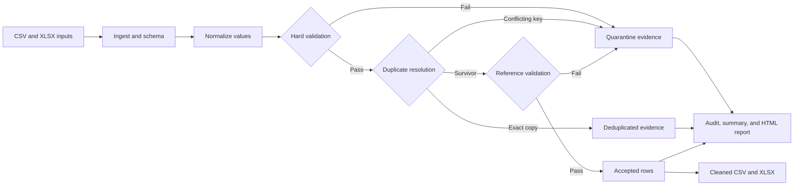

# DataForge

**From messy spreadsheets to validated, analysis-ready data.**

DataForge is a deterministic Python pipeline for a bounded e-commerce data-cleaning
engagement. It consolidates CSV and Excel files, normalizes safe formatting defects,
quarantines unsupported business facts, and returns client-ready data with source
provenance and an audit trail.

Python 3.11+ · openpyxl · RapidFuzz · pytest · GitHub Actions

```bash
python -m dataforge.cli --input data/demo_raw --output examples/output
```

| Demo result | Verified value |
| --- | ---: |
| Input files | 6 |
| Transaction rows | 164 |
| Accepted | 146 |
| Quarantined | 16 |
| Deduplicated | 2 |
| Material normalization events | 33 |
| Rejected/deduplicated evidence rows | 23 |
| Audit events | 63 |

The transaction equation reconciles exactly: **164 = 146 accepted + 16
quarantined + 2 deduplicated**.

## Before and after

These examples come from the committed synthetic demo and its generated outputs.

| Source row | Raw input | Pipeline decision | Result |
| --- | --- | --- | --- |
| `sales_2026_07.csv:3` | ` ord-0002 `, `02/07/2026`, `1 299,00 EUR`, ` france ` | Safely normalize and audit | Accepted as `ORD-0002`, `2026-07-02`, `1299.00`, `FR` |
| `sales_2026_07.csv:13` | Date `31/02/2026` | Do not guess an impossible date | Quarantined with `INVALID_ORDER_DATE` |
| `sales_2026_07.csv:15` | Price `1,299` | Do not guess an ambiguous separator | Quarantined with `INVALID_UNIT_PRICE` |
| `sales_2026_07.csv:42` | Exact copy of `ORD-0004` | Keep the first source-order row | Deduplicated with `DUPLICATE_EXACT` and survivor provenance |

## Client deliverables

One successful run writes exactly six artifacts to
[`examples/output/`](examples/output/):

| Artifact | What it gives the client |
| --- | --- |
| [`cleaned_sales.xlsx`](examples/output/cleaned_sales.xlsx) | A client-friendly workbook with typed dates and numbers, a frozen header, and filtering |
| [`cleaned_sales.csv`](examples/output/cleaned_sales.csv) | The same 146 accepted transactions in machine-friendly form |
| [`rejected_rows.csv`](examples/output/rejected_rows.csv) | Evidence for 16 quarantined and 2 deduplicated transactions, plus 3 rejected and 2 deduplicated reference rows |
| [`audit_log.csv`](examples/output/audit_log.csv) | 63 ordered events covering material normalizations, failures, flags, and deduplication |
| [`cleaning_summary.json`](examples/output/cleaning_summary.json) | Machine-readable run metadata, counts, reconciliation, input digests, and output names |
| [`data_quality_report.html`](examples/output/data_quality_report.html) | A self-contained, non-technical quality report with counts, defects, safeguards, and limitations |

The 23 rows in `rejected_rows.csv` are an evidence set, not a transaction
rejection count. Reference-data evidence remains separate from the transaction
reconciliation above.

## The business problem

A small business rarely receives one perfect table. Monthly exports can mix CSV
and Excel, rename columns, represent dates and EUR values differently, repeat
orders, omit identifiers, or disagree with customer and product references.
Blind coercion can make the file look cleaner while changing its meaning.

DataForge separates safe recovery from evidence preservation:

- known aliases, dates, currencies, identifiers, and categories are normalized;
- invalid or ambiguous business facts are quarantined with stable reason codes;
- exact duplicates are removed deterministically, while conflicting keys are
  quarantined as a group;
- fuzzy customer-name matches are flags only and never automatic merges;
- every accepted transaction keeps its source file, sheet, and row.

The governing principle is: **Never silently destroy customer data.**

## How the pipeline works



The precedence is fixed: normalization, hard validation, duplicate resolution,
reference validation, then acceptance. A hard-invalid row never enters duplicate
selection, and a conflicting order key never gets an arbitrary winner. See the
concise [architecture guide](docs/ARCHITECTURE.md) for module responsibilities.

## Safeguards and auditability

- **Deterministic source order:** normalized relative path, sheet, then source row.
- **Bounded rules:** exhaustive schema aliases and value formats; no heuristic
  schema inference.
- **Exact money handling:** EUR parsing and validation use decimal arithmetic.
- **Explicit disposition:** every ingested transaction is accepted, quarantined,
  or deduplicated exactly once.
- **Terminal reconciliation:** the three transaction sets are disjoint and must
  reproduce the input row set.
- **Provenance:** source file, worksheet, and row remain attached to every record.
- **Audit trail:** material changes and exclusions use stable codes and readable
  explanations.
- **Fail-safe publication:** artifacts are staged, reopened, checked, and then
  published without deleting unrelated files.
- **Fixture-independent production code:** the expected demo oracle is used by
  tests, not by the pipeline.

## Quality report preview

The generated [HTML quality report](examples/output/data_quality_report.html) is
self-contained and needs no web server. It summarizes processed inputs,
transaction dispositions, the passing reconciliation equation, defect and
normalization counts, reference-data quality, safeguards, deliverables, and the
bounded scope. All data-derived text is escaped, and the report contains no
external scripts or services.

## Quick start

From the repository root:

```bash
python -m pip install -e ".[dev]"
python -m dataforge.cli --input data/demo_raw --output examples/output
```

The command exits nonzero for unsafe paths or structural input failures. On
success it regenerates the six artifacts above. Source inputs remain unchanged,
and unrelated files already present in the output directory are preserved.

Run the test suite with:

```bash
pytest
```

Current verified result: **308 passed**. Coverage includes ingestion,
normalization, validation, deduplication, reference handling, audit completeness,
output determinism, the end-to-end CLI, and comparison with the preregistered
demo oracle.

## Reproducible demo

The publishable corpus is synthetic and generated from fixed inputs:

| Setting | Value |
| --- | --- |
| Seed | `1007` |
| Demo date | `2026-10-07` |
| Timezone | `Europe/Paris` |

Current time, locale, filesystem enumeration, and external services do not
determine the demo result. Regenerate the source corpus with:

```bash
python scripts/generate_demo_data.py
```

CSV, JSON, and HTML outputs are byte-deterministic. XLSX files are checked by
semantic workbook content because ZIP container metadata may vary without
changing sheets, values, types, or ordering.

## Repository map

```text
src/dataforge/        production package
tests/                deterministic test suite
data/demo_raw/        intentionally messy synthetic input
data/demo_expected/   preregistered test oracle
examples/output/      six generated client deliverables
docs/                 specification and architecture
scripts/              deterministic demo generator
```

The implementation details live in [`docs/ARCHITECTURE.md`](docs/ARCHITECTURE.md).
The original project authority is
[`DataForge_Project_Workflow_v1.0.pdf`](DataForge_Project_Workflow_v1.0.pdf), with
the adopted deterministic clarifications in
[`docs/NORMATIVE_APPENDIX_v1.0.1.md`](docs/NORMATIVE_APPENDIX_v1.0.1.md).

## Scope and limitations

DataForge v1 is deliberately bounded:

- synthetic e-commerce data only;
- CSV and XLSX inputs with frozen sales, customer, and product schemas;
- documented aliases and deterministic rule-based cleaning;
- no database, warehouse, distributed processing, or web application;
- no ML anomaly detection, LLM cleaning, or fuzzy automatic merge;
- no universal schema inference or claim of arbitrary-dataset support.

This repository demonstrates Python engineering, spreadsheet processing,
deterministic cleaning, validation, testing, auditability, and practical client
delivery within that scope.

## License

Licensed under the [MIT License](LICENSE).
